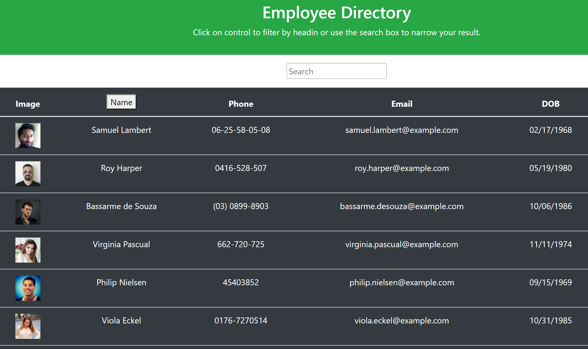

 
Explore the [project-page](https://github.com/Mgithub89/react-employee-directory.git).

View the [Deloyed App](https://mgithub89.github.io/react-employee-directory/)

## Description
 Employee Directory application with react.
 

## Table Of Contents 
* [Installation](#Installation)
* [Usage](#Usage)
* [Technologies Used](#Technologies-Used)
* [Contributing](#Contributing)
* [Tests](#Tests)
* [License](#License)
* [Questions](#Questions)

## Installation
* Clone repo.
* install all the dependencies(npm i ...).

## usage 

## Screen Shoot
1. Last Workout

## Contributing
* Feel free to contribute. just contact me via email and fork my project

## Tests
* None

## License 
 
 For more information about the License , click on the link below.
 * [License](https://opensource.org/licenses/MIT)

## Questions
* For Questions you can reach me at [metages09@gmail.com](mailto:metages09@gmail.com)
* visit my [github profile](https://github.com/Mgithub89)
        

